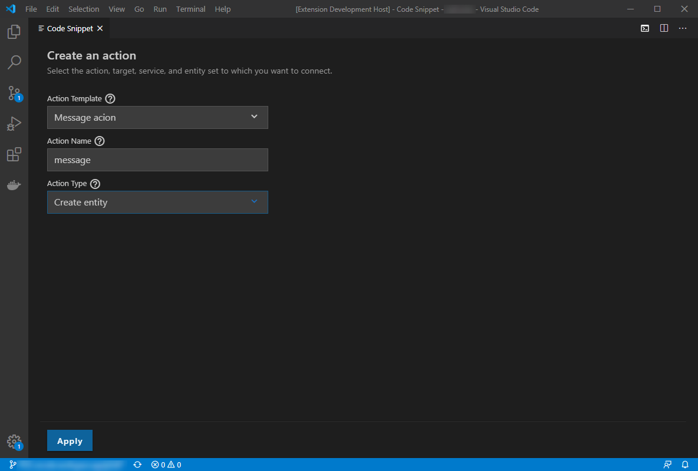

[](https://circleci.com/gh/SAP/code-snippet)
[](https://coveralls.io/github/SAP/code-snippet?branch=master)
[](https://lgtm.com/projects/g/SAP/code-snippet/context:javascript)
[](http://commitizen.github.io/cz-cli/)

[](https://api.reuse.software/info/github.com/SAP/code-snippet)
[](https://dependabot.com/)

# Code Snippet



## Description

This extension allows developers to add generic code pieces to their project and provide wizard-like experience with minor development efforts.
The repository contains three main packages:

- **Frontend** - The Code Snippet as a standalone vue.js application.
- **Backend** - The backend part. Runs as a VSCode extension or node.js application.
- **VSCode snippet contributor example** - Example snippet contibutor to show usage.

## Requirements

- [node.js](https://www.npmjs.com/package/node) version 10 or higher.
- [VSCode](https://code.visualstudio.com/) 1.39.2 or higher or [Theia](https://www.theia-ide.org/) 0.12 or higher.

## Download and Installation

To test run the framework you only need to build and install the backend package, which will automatically build and run the UI.

### installation

- Clone this repository
- cd into the backend folder
  ```bash
  cd packages/backend
  ```
- To install, compile and prepare the static resources run the following commands:
  ```bash
  npm run backend
  npm run frontend
  ```

### Usage & Development

#### Run the dev mode

Dev mode allows you to run the framework in the browser, using vue cli for fast development cycles, and easy debug tools.
To run it do the following:

- In the backend folder run webpack or webpack-dev, then run the server.
  ```bash
  npm run webpack-dev
  npm run ws:run
  ```
- In the frontend folder run serve
  ```bash
  npm run serve
  ```
- Open the broswer on localhost:8080 to access the framework.

#### Run the VSCode extension

- Start VSCode on your local machine, and click on open workspace. Select this repo folder.
- On the debug panel choose "Run Extensions", and click on the "Run" button.

#### Advanced scenarios

To develop and contribute you can build and install each package separately. Instruction on each package in the dedicated readme.md file.

- [Build & install the client](packages/frontend/README.md)
- [Build & install the backend](packages/backend/README.md)

## How to obtain support

To get more help, support, and information please open a github [issue](https://github.com/SAP/code-snippet/issues).

## Contributing

Contributing information can be found in the [CONTRIBUTING.md](CONTRIBUTING.md) file.
