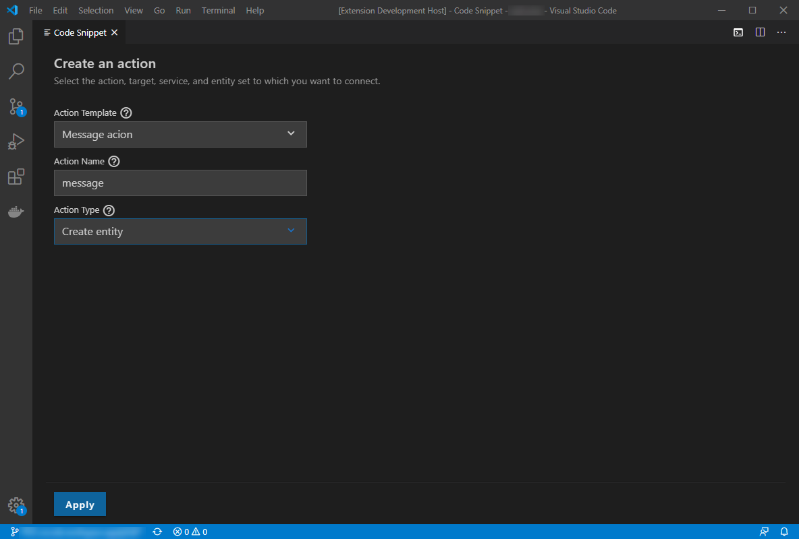

# Code Snippet (Framework) VSCode Extension

## Preview

## Description

This component is the VSCode extension part of the VSCode Code Snippet Framework.
It is responsible for:

- Loading code snippets contributions (plugins) (e.g [vscode-snippet-contrib](../../examples)).
- Rendering the code snippet form GUI to display relevant questions to the end user
  - inside a [VSCode webview](https://code.visualstudio.com/api/extension-guides/webview).
  - Note that the form GUI is developed, in a separate [sub-package](../frontend).
- Bridging between the frontend GUI and the contributions/plugins, e.g:
  - Invoking custom validation logic.
  - Sending the "answers" of the end user back to the contribution/plugin.
